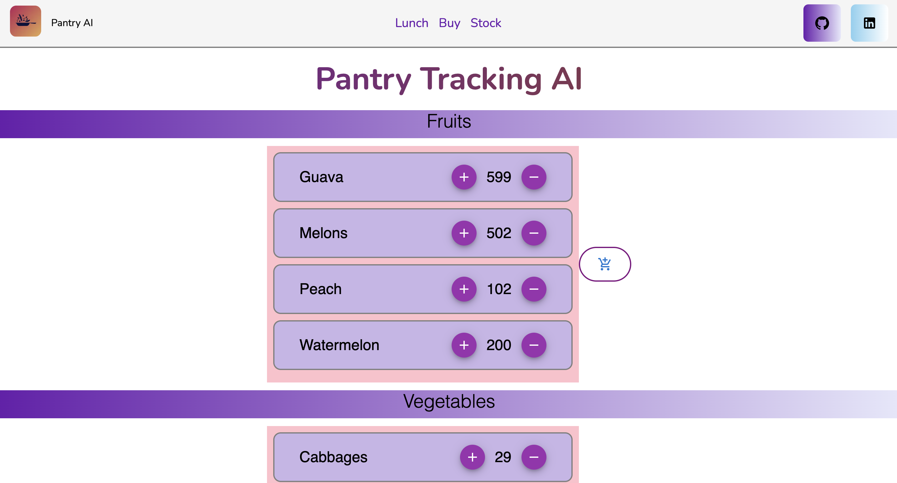

# Pantry Tracking AI App

## Overview

The Pantry Tracking AI App is a smart inventory management system designed to help users efficiently track and manage their pantry or storage items. Built with a focus on simplicity and ease of use, this app leverages AI technology to provide real-time insights, smart recommendations, and intuitive item management.

## Features

- **Real-time Inventory Tracking:** Keep track of your pantry items effortlessly with real-time updates.
- **AI-Driven Insights:** Receive smart recommendations based on inventory levels and usage patterns.
- **Easy Item Management:** Quickly add, update, or remove items, with support for drag-and-drop deletion.
- **Customizable Inventory Categories:** Manage different types of inventory, such as fruits, vegetables, and more.
- **User-Friendly Interface:** Enjoy a clean and intuitive design that makes inventory management a breeze.
- **Mobile and Web Compatibility:** Access your inventory from any device, whether on desktop or mobile.

## User Interface


## Usage Video:

## Technology Stack

- **Frontend:** React (with Material UI)
- **Backend:** Firebase Firestore (for real-time database)
- **AI Integration:** AI algorithms for generating insights and recommendations
- **Hosting:** Deployed on Vercel

## Installation

### Prerequisites

- Node.js (v14 or higher)
- npm or yarn
- Firebase account

### Steps

1. **Clone the Repository**
   ```bash
   git clone https://github.com/faranbutt/Pantry_AI
   cd pantry-tracking-ai
   ```
2. **Install Dependencies**
```bash
npm install
# or
yarn install
```
3. **Set Up Firebase**
```bash
Create a Firebase project at Firebase Console.
Set up Firestore as your database.
Copy your Firebase config and replace the placeholder in firebase.js.
```

4. **Install Dependencies**
```bash
npm run dev
# or
yarn run dev
```
## Usage

### Adding Items:
- Click the "Add" button to open the modal.
- Enter the item name, quantity, and select the type of inventory (e.g., Fruits, Vegetables).
- Click "Add" to save the item.

### Updating Items:
- Use the "+" and "-" buttons next to each item to adjust quantities.

### Deleting Items:
- Drag and drop an item into the delete area (dustbin icon) to remove it from the inventory.

### Viewing Inventory:
- The main screen displays all items in the selected category. Use the dropdown to switch between categories.

## Contributing

Contributions are welcome! Please fork the repository and submit a pull request with your improvements.

## License

This project is licensed under the MIT License. See the [LICENSE](LICENSE) file for details.

## Contact

If you have any questions or suggestions, feel free to reach out:

- **Email:** [Mail](mailto:faranbutt789@gmail.com)
- **LinkedIn:** [/in/faranbutt](https://www.linkedin.com/in/faranbutt/)
- **GitHub:** [github.com/faranbutt](https://github.com/faranbutt)

---

Thank you for using the Pantry Tracking AI App!
